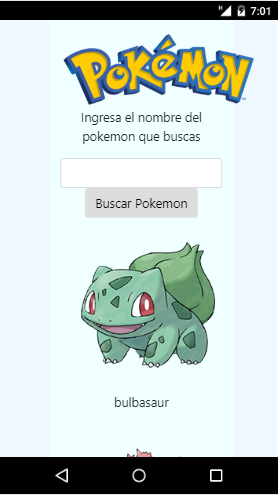
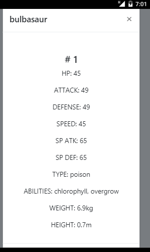

## POKEDEX

Se desarrolla un Pokedex donde los usuarios pueden visualizar cada uno de los pokemones en la primera vista, o pueden realizar una busqueda donde muestra el pokemon con sus habilidades y tipos de ataque.

### VISUALIZACIÓN EN DESKTOP

### RETO

Un pokedex es un buscador de Pokemons, donde puedes obtener información sobre el pokemon que buscas. Usando la API de Pokeapi diseña tu propio pokedex. 

### TECNOLOGÍAS APLICADAS

- Bootstrap
- Jquery
- HTML5
- CSS3

### ELABORADO PARA LABORATORIA

### ELABORADO POR:
Francia Vázquez Ornelas